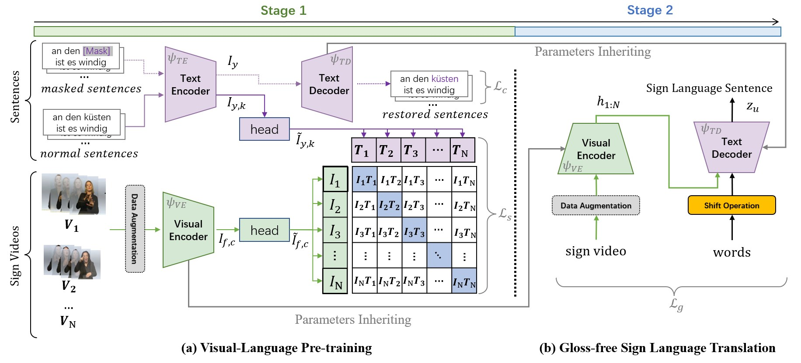

# [[ICCV'23](https://openaccess.thecvf.com/content/ICCV2023/html/Zhou_Gloss-Free_Sign_Language_Translation_Improving_from_Visual-Language_Pretraining_ICCV_2023_paper.html)] Gloss-free Sign Language Translation: Improving from Visual-Language Pretraining

<a href="https://pytorch.org/get-started/locally/"></a>  [](https://arxiv.org/abs/2307.14768)

[](https://paperswithcode.com/sota/gloss-free-sign-language-translation-on?p=gloss-free-sign-language-translation)
[](https://paperswithcode.com/sota/gloss-free-sign-language-translation-on-csl?p=gloss-free-sign-language-translation)


This repo is the official implementation of "Gloss-free Sign Language Translation: Improving from Visual-Language Pretraining" as well as the follow-ups. It currently includes code and models for the following tasks:

> **Gloss-free Sign Language Translation**: Included in this repo.

> **Visual-Language Pre-training in SLT Tasks.**: Included in this repo.


## NEWS

***2023/12/26***

1. One can use the official 12-layer Mbart decoder for text decoding by setting ```--decoder-type LLMD```. However, it is important to note that this requires pre-training using ```train_vlp.py```.

## Installation

```bash
conda create -n gfslt python==3.8
conda activate gfslt

# Please install PyTorch according to your CUDA version.
pip install -r requirements.txt
```


## Getting Started


### Preparation
Please refer to [pretrain_models](pretrain_models/README.md) to prepare MBart weight file and GFSLT model.

### VLP Pretrain

If the goal is to solely pre-train the Visual Encoder, the optimal approach would involve employing the fundamental visual-language alignment strategy. This method stands out as a straightforward and highly efficient means of SLT pre-training.

```bash
CUDA_VISIBLE_DEVICES=0,1,2,3 python -m torch.distributed.launch --nproc_per_node=4 --master_port=1236 --use_env train_vlp.py --batch-size 4 --epochs 80 --opt sgd --lr 0.01 --output_dir out/vlp  
```

### VLP Pretrain V2
If the objective is to simultaneously pre-train both the visual encoder and text decoder, the recommended approach is to adopt the VLP-V2 version. This version employs a methodology that combines Contrastive Language-Image Pretraining (CLIP) with masked self-supervised learning, resulting in the creation of pre-tasks that effectively bridge the semantic gap between visual and textual representations while also restoring masked sentences. Consequently, this integrated method enables the achievement of joint pre-training for the visual encoder and text decoder.
```bash
CUDA_VISIBLE_DEVICES=0,1,2,3 python -m torch.distributed.launch --nproc_per_node=4 --master_port=1236 --use_env train_vlp_v2.py --batch-size 4 --epochs 80 --opt sgd --lr 0.01 --output_dir out/vlp_v2 --training-refurbish True --noise-rate 0.15 --noise-type omit_last --random-shuffle False  
```

### GFSLT-VLP
Irrespective of the chosen pre-training strategy, when undertaking downstream sign language translation tasks, 
you only need to utilize the --finetune hyperparameter to designate the relevant pre-trained model.
```bash
CUDA_VISIBLE_DEVICES=0,1,2,3 python -m torch.distributed.launch --nproc_per_node=4 --master_port=1236 --use_env train_slt.py --batch-size 2 --epochs 200 --opt sgd --lr 0.01 --output_dir out/Gloss-Free \
--finetune ./out/vlp/checkpoint.pth 
```

### Evaluation
To obtain more accurate evaluation results and multiple metrics, including BLER-n, METEOR, ROUGE_L, and CIDEr, it is strongly recommended to perform a systematic evaluation with the following commands on a single GPU. 
```bash
CUDA_VISIBLE_DEVICES=0 python -m torch.distributed.launch --nproc_per_node=1 --master_port=1236 --use_env train_slt.py --batch-size 2 --epochs 200 --opt sgd --lr 0.01 --output_dir out/Gloss-Free --resume out/Gloss-Free/best_checkpoint.pth --eval 
```
However, to use these commands, you need to install the [nlgeval](https://github.com/Maluuba/nlg-eval) package, one can also refer to the [README.md](./metrics/README.md) for instructions on how to install it.

## Citation

If you find our work useful for your project, please consider citing the paper:

```bibtex
@InProceedings{Zhou_2023_ICCV,
    author    = {Zhou, Benjia and Chen, Zhigang and Clap\'es, Albert and Wan, Jun and Liang, Yanyan and Escalera, Sergio and Lei, Zhen and Zhang, Du},
    title     = {Gloss-Free Sign Language Translation: Improving from Visual-Language Pretraining},
    booktitle = {Proceedings of the IEEE/CVF International Conference on Computer Vision (ICCV)},
    month     = {October},
    year      = {2023},
    pages     = {20871-20881}
}
```

# LICENSE
The code is released under the MIT license.